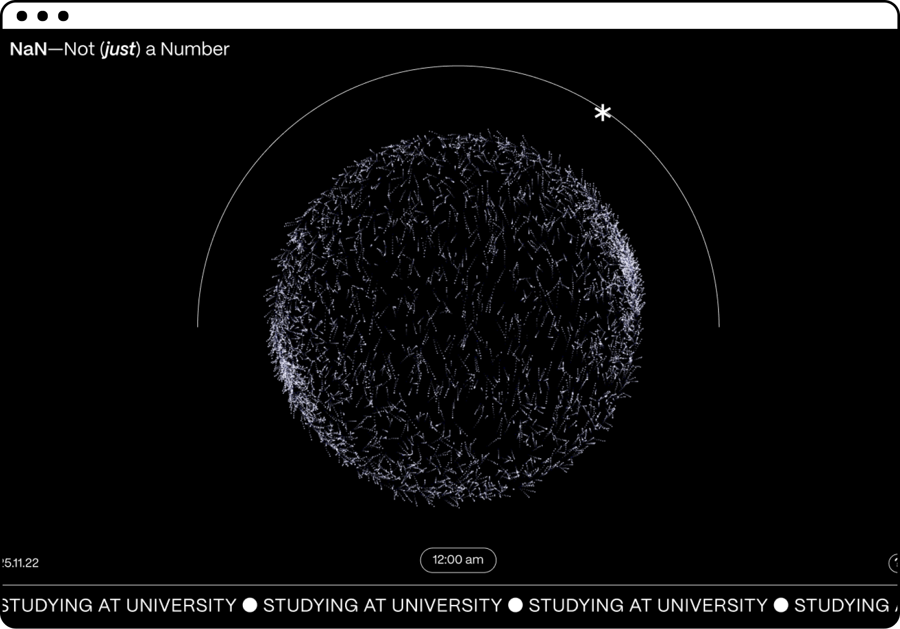
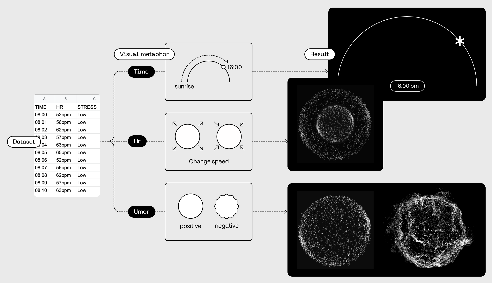
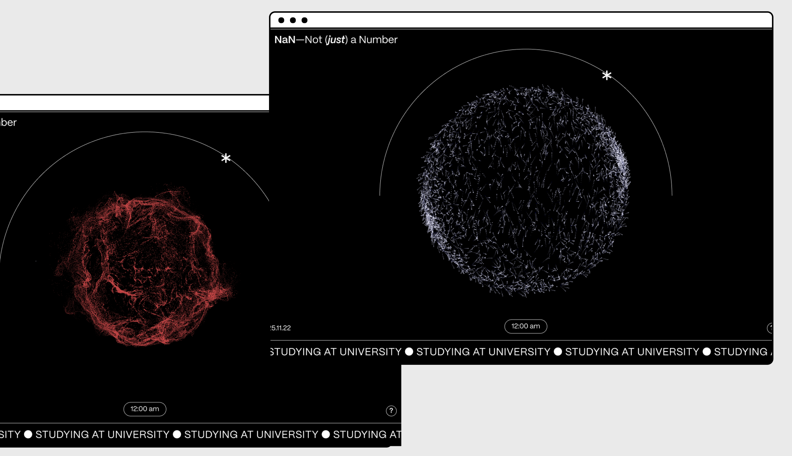

# NaN — Not *(just)* a Number
How an algo sees me — emotions from smartwatch data

  

###### ABSTRACT
A generative artwork that, through a data driven approach, provides a new ex-ploratory experience of the dataset. The focus is on emotion recognition, using heart rate data from a  smartwatch.

###### METHOD

  

###### OVERVIEW

  

